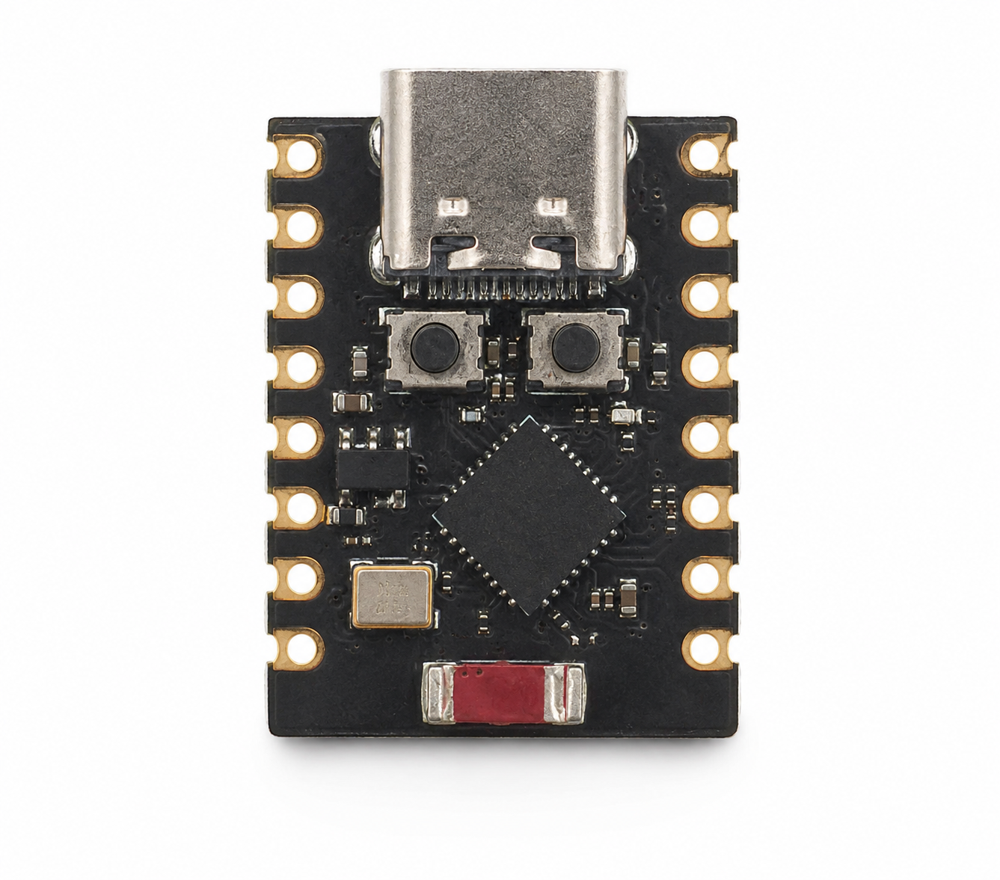
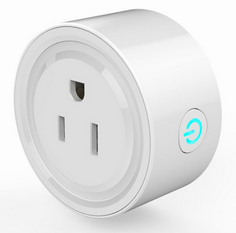

# ESP32 Wake-on-LAN

Firmware for an ESP32/ESP32-C3 board that connects to WiFi and sends a Wake-on-LAN magic packet to a target computer on the local network. The idea of the ESP32-C3 is to try compact the space as more we can.

<p align="center">
  
</p>

The application is built with ESP-IDF. A Docker-based ESP-IDF environment is included so the project can be built and flashed without installing the ESP-IDF toolchain directly on the host.

Note: The extra cost comes from needing a remote Wi-Fi smart plug for this setup. The main idea is to remotely power up the ESP32; once it is ready, it sends a magic packet to the PC.

<p align="center">
  
</p>

## What It Does


On boot, the ESP32:

1. Connects to the configured WiFi network as a station.
2. Builds a Wake-on-LAN magic packet for the configured target MAC address.
3. Broadcasts the packet three times over UDP port `9`.
4. Logs completion.

The Wake-on-LAN packet is the standard 102-byte payload:

- 6 bytes of `0xFF`
- The target MAC address repeated 16 times

## Project Layout

```text
.
|-- CMakeLists.txt              # ESP-IDF project definition
|-- ReadMe.md                   # Main project documentation
|-- sdkconfig.defaults          # Optional default ESP-IDF configuration
|-- main/
|   |-- CMakeLists.txt          # Main component definition
|   `-- main.c                  # WiFi and Wake-on-LAN firmware
`-- Docker/
    |-- Dockerfile              # ESP-IDF Docker image
    |-- ReadMe.md               # Docker workflow notes
    |-- InstallDocker.md        # Docker installation notes
    `-- installdocker.sh        # Docker installation helper script
```

## Requirements

### Hardware

- ESP32 or ESP32-C3 development board
- USB cable for flashing
- A computer on the same LAN with Wake-on-LAN enabled
- A network that allows local UDP broadcast traffic

### Software

Use one of these setups:

- Docker, using the included `Docker/Dockerfile`
- A local ESP-IDF installation compatible with ESP-IDF `release/v5.5`

## Configure the Firmware

Configure the project with ESP-IDF menuconfig:

```bash
idf.py set-target esp32c3
idf.py menuconfig
```

Open:

```text
ESP32 Wake-on-LAN Configuration
```

Set these values:

- `WiFi SSID`
- `WiFi password`
- `Wake-on-LAN broadcast IP`
- `Target computer MAC address`

Examples:

- For `192.168.0.x/24`, use `192.168.0.255`
- For `192.168.1.x/24`, use `192.168.1.255`
- For `10.0.0.x/24`, use `10.0.0.255`

The MAC address must use colon-separated hexadecimal bytes, for example `AA:BB:CC:DD:EE:FF`.

## Build With Docker

From the repository *root*, build the ESP-IDF image:

```bash
docker build -t esp-idf Docker
```

Run the container with the project mounted and the USB serial device shared:

```bash
sudo docker run --rm -it \
  --device=/dev/ttyACM0 \
  -v $PWD:/project \
  esp-idf
```

Inside the container, build the firmware:

```bash
idf.py set-target esp32c3
idf.py build
```

For a classic ESP32 board, use:

```bash
idf.py set-target esp32
idf.py build
```

## Flash With Docker

Connect the board and check the serial device on the host:

```bash
ls /dev/ttyS* /dev/ttyUSB* /dev/ttyACM*
```

In this workspace, the ESP32-C3 appears as `/dev/ttyACM0`.

Run the container with the USB device passed through:

```bash
sudo docker run --rm -it \
  --device=/dev/ttyACM0 \
  -v $PWD:/project \
  esp-idf
```

Inside the container:

```bash
idf.py -p /dev/ttyACM0 flash monitor
```

If your board appears on a different serial device, replace `/dev/ttyACM0` in both commands.

## Build Without Docker

If ESP-IDF is installed locally, open an ESP-IDF shell or source the ESP-IDF environment:

```bash
. "$IDF_PATH/export.sh"
```

Then build:

```bash
idf.py set-target esp32c3
idf.py build
```

Flash and monitor:

```bash
idf.py -p /dev/ttyACM0 flash monitor
```

## Expected Logs

During a successful run, the serial monitor should show messages similar to:

```text
Connecting to WiFi SSID: ...
Got IP: ...
Connected to WiFi
Sending Wake-on-LAN packet...
WOL packet sent 1/3, bytes=102
WOL packet sent 2/3, bytes=102
WOL packet sent 3/3, bytes=102
Done.
```

## Wake-on-LAN Checklist

If the target computer does not wake, verify:

- Wake-on-LAN is enabled in the computer BIOS/UEFI.
- Wake-on-LAN is enabled in the operating system network adapter settings.
- The target computer is connected by Ethernet if its WiFi adapter does not support Wake-on-LAN.
- The configured MAC address belongs to the active network adapter.
- The ESP32 and target computer are on the same local network.
- `Wake-on-LAN broadcast IP` matches the subnet.
- The router or access point allows UDP broadcast packets.
- The target computer still has standby power while off or sleeping.

## Troubleshooting

### WiFi Connection Timeout

Check the configured `WiFi SSID`, `WiFi password`, signal strength, and the WiFi security mode. The firmware currently uses:

```c
wifi_config.sta.threshold.authmode = WIFI_AUTH_WPA2_PSK;
```

If your network uses a different authentication mode, adjust this setting in [main/main.c](/home/tonixscarlet/Documents/ESP32WOL/main/main.c).

### Permission Denied on Serial Port

On Linux, add your user to the `dialout` group:

```bash
sudo usermod -aG dialout "$USER"
```

Then log out and log back in, or run:

```bash
newgrp dialout
```

For a temporary local workaround:

```bash
sudo chmod 666 /dev/ttyACM0
```

### Docker Cannot Access the Board

Make sure the container is started with the correct device:

```bash
sudo docker run --rm -it --device=/dev/ttyACM0 -v $PWD:/project esp-idf
```

If the board reconnects during flashing, confirm whether the device path changed.

### Failed to Connect to ESP32-C3

If flashing fails with this error:

```text
Failed to connect to ESP32-C3: No serial data received.
```

The serial port is available, but the ESP32-C3 is not responding. Check these items:

- Confirm the real device path on the host:

```bash
ls /dev/ttyS* /dev/ttyUSB* /dev/ttyACM*
```

- Pass the same device into Docker with `--device`.
- Use the same device inside the container with `idf.py -p`.
- Hold the board `BOOT` button, tap `RESET`, release `RESET`, then release `BOOT`, and run flash again.
- Try a lower baud rate if the connection is unstable:

```bash
idf.py -p /dev/ttyACM0 -b 115200 flash monitor
```

- Check that the USB cable supports data, not only charging.
- If your board appears as `/dev/ttyS0` or `/dev/ttyUSB0`, replace `/dev/ttyACM0` in both the Docker command and the `idf.py -p` command.

## Notes

- The firmware sends the WOL packet once at boot.
- To trigger WOL again, reset or power-cycle the ESP32.
- The packet is sent three times with a short delay to improve reliability.
- The default WOL port is `9`, defined by `WOL_PORT`.
